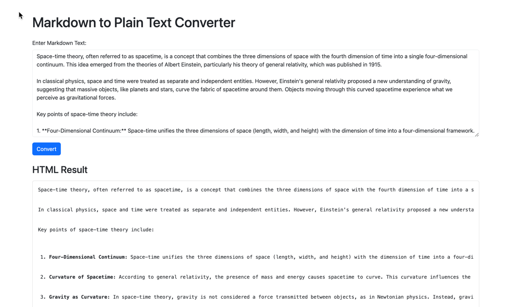

# Markdown to Plain Text Converter



This is a simple web application that converts Markdown text to plain text. It provides a user-friendly interface for entering Markdown text and viewing the corresponding plain text and HTML results. Additionally, it displays the current time, line count, and word count dynamically.

## Features

- **Markdown to Plain Text Conversion:** Enter your Markdown text and convert it to plain text and HTML.
- **Real-time Line and Word Count:** View the current line count and word count as you type.
- **Clipboard Copy:** Easily copy the converted HTML to the clipboard with a click.

## Usage

1. Clone the repository:

    ```bash
    git clone https://github.com/minmyatoo/markplain.git
    ```

2. Install dependencies:

    ```bash
    npm install
    ```

3. Run the server:

    ```bash
    node index.js
    ```

4. Open your browser and navigate to [http://localhost:3000](http://localhost:3000).

## Dependencies

- [Express](https://expressjs.com/)
- [Showdown](https://github.com/showdownjs/showdown)
- [SweetAlert2](https://sweetalert2.github.io/)

## License

This project is licensed under the MIT License - see the [LICENSE.md](LICENSE.md) file for details.
